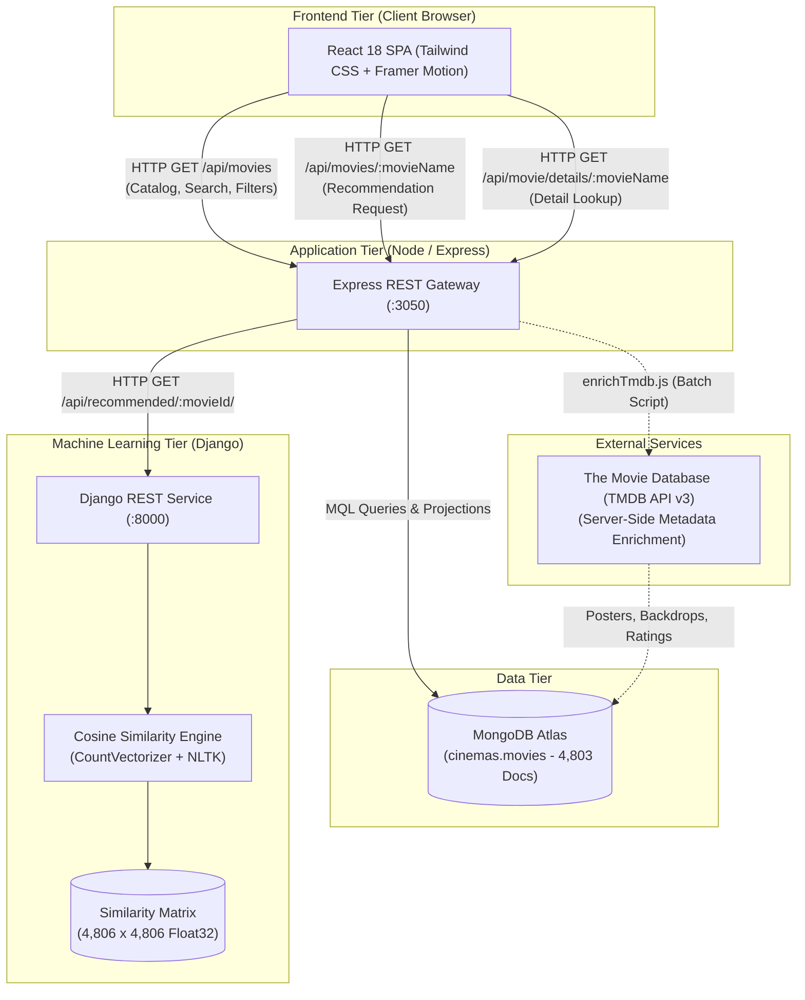

# CineMatch — Movie Recommendation System

A full-stack, content-based movie recommendation and discovery platform. CineMatch pairs natural language processing algorithms with a production-grade web application to provide instant film recommendations, catalog browsing, and enriched cinematic metadata across 4,800+ titles.

---

## Overview

CineMatch is engineered as a three-tier distributed architecture designed to solve the film discovery problem using content similarity:

1. **Client Interface:** A responsive React 18 single-page application styled with Tailwind CSS, featuring an automated cinematic hero slider, debounced search, multi-criteria filtering, and dedicated movie detail views.
2. **Application Gateway:** A Node.js and Express REST API orchestrating client requests, querying MongoDB Atlas for catalog data, and interfacing with the machine learning recommendation service.
3. **ML Recommendation Service:** A Django REST service hosting a vectorized content similarity model built with Scikit-learn and NLTK, calculating cosine distances across a precomputed 4,806 × 4,806 similarity matrix.

---

## Features

### Movie Discovery & Exploration
- **Cinematic Hero Slideshow:** Automated, responsive 6-slide visual presentation featuring curated cinematic backdrops with smooth transition animations and manual navigation controls.
- **Full Catalog Browsing:** Paginated browsing across 4,803 movie documents with 24 cards per page, page navigation controls, and catalog count tracking.
- **Real-Time Debounced Search:** Instant title and overview matching with debounced input to prevent excessive API queries.
- **Multi-Parameter Filtering:**
  - **Genre Selection:** Dynamic genre filtering populated directly from catalog data (Action, Drama, Sci-Fi, etc.).
  - **Minimum Rating Filter:** Filter films by minimum TMDB vote averages (e.g., 7.0+, 8.0+).
  - **Release Era Filtering:** Filter by release decades (2010s, 2000s, 1990s, 1980s, and older).
- **Multi-Field Sorting:** Sort catalog results by popularity (default), vote average, release date, or alphabetical title (A–Z / Z–A).

### Recommendation Experience
- **Content-Based Similarity:** Natural Language Processing model computing semantic similarity across plot overviews, genres, keywords, top cast members, and directors.
- **"More Like This" Recommendations:** Generates an ordered set of the top 6 most similar films for any queried title, preserving cosine similarity rankings (#01 to #06).
- **Direct Card Recommendation Triggers:** Click "More Like This" directly on any catalog or recommendation card to re-query the recommendation engine without typing.

### Cinematic Detail View
- **Interactive Detail Panels:** Dedicated presentation view displaying high-resolution TMDB backdrops, official posters, release dates, runtime, vote averages, genres, taglines, and synopsis.
- **Seamless Navigation:** Dismissing a detail view smoothly returns the user to their exact catalog scroll position.

### Resilience & Accessibility
- **Graceful Image Fallbacks:** Poster and backdrop error-handling with styled cinematic fallback visuals when third-party assets fail to load.
- **Request Cancellation & Guarding:** Axios `AbortController` integration prevents race conditions and cancels stale catalog/recommendation requests.
- **Accessibility & Motion Preferences:** Semantic HTML buttons, accessible ARIA labels, visible focus rings, and full `prefers-reduced-motion` compliance.

---

## System Architecture



### Request Flow
1. **Catalog Browsing:** The user browses, searches, or filters the catalog. The React frontend sends a `GET /api/movies` request with query parameters. Express validates the query, builds a MongoDB filter, and returns paginated movie documents.
2. **Recommendation Generation:**
   - The user requests recommendations for a film (e.g., *"Avatar"*).
   - Express queries MongoDB Atlas to locate the movie's unique integer `id`.
   - Express issues an internal HTTP request to the Django ML service: `GET /api/recommended/<movie_id>/`.
   - Django maps the ID to its internal index, extracts the precomputed cosine distance vector from `similarity.pkl`, sorts descending, and returns the top 6 recommended IDs.
   - Express fetches the 6 corresponding movie records from MongoDB, orders them to strictly match Django's similarity ranking, and returns the response to the client.

---

## Technology Stack

| Layer | Technologies | Role in System |
|---|---|---|
| **Frontend** | React 18, Tailwind CSS, Framer Motion, Lucide React, Axios | Responsive Single Page Application, cinematic animations, catalog filtering, accessible UI controls |
| **Backend** | Node.js, Express 4, Mongoose 8, Axios, CORS, Dotenv | API Gateway, request validation, MongoDB MQL querying, Django service integration |
| **Database** | MongoDB Atlas, Mongoose ODM | Cloud document storage for 4,803 movie records, compound indexing on title, popularity, rating, release date, and genres |
| **Machine Learning** | Python 3, Django 4/5, Django REST Framework, Pandas, NumPy, Scikit-learn, NLTK | Content-based recommendation service, bag-of-words vectorization, cosine similarity computation |
| **External API** | The Movie Database (TMDB API v3) | Server-side metadata enrichment (poster paths, backdrop paths, vote averages, popularity metrics) |

> **Note on Technologies:** CineMatch does not use deep learning, neural networks, TensorFlow, PyTorch, Hadoop, or Spark. The recommendation engine is an exact, deterministic content-based vector similarity model.

---

## Machine Learning Engine

### Model Architecture
CineMatch is a **content-based movie recommendation system** (specifically, a **content-based similarity-based recommendation system**). Recommendations are computed purely from intrinsic metadata attributes of the films themselves, without relying on collaborative user profiles, ratings matrices, or user history.

### Feature Extraction & Engineering
Artifact generation is performed by `ML_Model/generate_artifacts.py`:
1. **Data Ingestion:** Merges `movies.csv` and `credits.csv` on movie `title`.
2. **Extracted Features:**
   - `overview`: Plot summary text.
   - `genres`: JSON-extracted genre names (e.g., *Action*, *Adventure*).
   - `keywords`: JSON-extracted plot concept keywords.
   - `cast`: Top 3 billed cast members extracted from credit records.
   - `crew`: The film's primary Director (`job == 'Director'`).
3. **Token Normalization:** Whitespace is stripped from multi-word tokens (e.g., `"Sam Worthington"` becomes `"SamWorthington"`; `"Science Fiction"` becomes `"ScienceFiction"`) to prevent conflating first names or genres across distinct entities.
4. **Tag Synthesis:** Features are concatenated into a consolidated `tags` string:
   $$\text{tags} = \text{overview} + \text{genres} + \text{keywords} + \text{cast} + \text{crew}$$
5. **Stemming:** Text tokens are lowercased and stemmed using NLTK's `PorterStemmer` (e.g., *"actions"*, *"acting"*, and *"action"* normalize to *"action"*).

### Vectorization & Similarity Metric
- **Vector Model:** Scikit-learn `CountVectorizer(max_features=5000, stop_words='english')`.
- **Dimensionality:** Each movie is represented as a 5,000-dimensional bag-of-words frequency vector.
- **Metric:** Cosine similarity measures the angle between two feature vectors $\mathbf{u}$ and $\mathbf{v}$:
  $$\text{Cosine Similarity}(\mathbf{u}, \mathbf{v}) = \frac{\mathbf{u} \cdot \mathbf{v}}{\|\mathbf{u}\|_2 \|\mathbf{v}\|_2}$$
- **Similarity Matrix:** A symmetric $4{,}806 \times 4{,}806$ floating-point matrix representing pairwise similarity across all indexed films.

### Dataset Dimensions & Discrepancy Reconciliation
- `ML_Model/movies.csv`: Contains **4,803** unique movie records.
- `ML_Model/credits.csv`: Contains **4,803** credit rows.
- Merging on `title` yields **4,806** rows due to three duplicate title occurrences in the raw source dataset (*The Host*, *Out of the Blue*, *Batman*).
- As a result:
  - `Movie_Python/movie_dict.pkl` contains **4,806** indexed entries.
  - `Movie_Python/similarity.pkl` has dimensions **4,806 × 4,806**.
  - MongoDB Atlas catalog contains **4,803** deduplicated records keyed on unique integer `id`.

### Recommendation Generation
When queried with movie ID $M$:
1. Django resolves $M$ to row index $i$ in `movie_dict.pkl`.
2. Vector $\mathbf{s} = \text{similarity}[i]$ is retrieved.
3. Distances are sorted in descending order: `sorted(list(enumerate(s)), reverse=True, key=lambda x: x[1])`.
4. Slice `[1:7]` is extracted: index 0 (the film itself, similarity = 1.0) is discarded, and the top 6 closest neighbors are returned.

---

## Data Management & MongoDB Catalog

The presentation catalog is stored in MongoDB Atlas within database `cinemas`, collection `movies`.

### Document Schema
```javascript
{
  id: Number,             // TMDB integer movie ID (indexed)
  title: String,          // Movie title (indexed)
  overview: String,       // Plot synopsis
  release_date: Date,     // Release timestamp (indexed)
  runtime: Number,        // Duration in minutes
  tagline: String,        // Promotional tagline
  homepage: String,       // Official website URL
  poster_path: String,    // TMDB relative poster path (e.g., "/5iTwPDNtv...jpg")
  backdrop_path: String,  // TMDB relative backdrop path (e.g., "/jXntuh4...jpg")
  genres: [String],       // Array of genre strings (indexed)
  vote_average: Number,   // TMDB user rating (0.0 to 10.0, indexed)
  popularity: Number      // TMDB algorithmic popularity score (indexed)
}
```

### Database Indexes
- `{ title: 1 }`: Optimizes regex search and alphabetical sorting.
- `{ popularity: -1 }`: Optimizes default discovery catalog ordering.
- `{ vote_average: -1 }`: Accelerates rating threshold filters.
- `{ release_date: -1 }`: Speeds up decade/year range filters.
- `{ genres: 1 }`: Multi-key index supporting fast genre matching.

### Seed Utility
The database is seeded via `Backend/seed.js`:
- Reads `ML_Model/movies.csv`.
- Uses bulk `bulkWrite` operations with `updateOne({ id }, { $set: doc }, { upsert: true })` to prevent duplicates.
- Supports dry-run validation via `node seed.js --dry-run`.

---

## TMDB Metadata Enrichment

To deliver a modern visual experience, raw catalog data from `movies.csv` was enriched using The Movie Database (TMDB) API v3 via `Backend/enrichTmdb.js`.

### Enriched Metadata Fields
- `poster_path`: High-resolution vertical key art.
- `backdrop_path`: 16:9 panoramic cinematic backdrops.
- `genres`: Standardized TMDB genre categories.
- `vote_average`: Community rating score rounded to one decimal place.
- `popularity`: Floating-point popularity ranking metric.

### Verified Enrichment Run Results
During the verified batch enrichment execution across the entire catalog:
- **Total Records Evaluated:** 4,803
- **Successfully Enriched:** 4,795
- **Unavailable / Not Found on TMDB (404):** 8 records
- **Network / Rate-Limit (429) Failures:** 0

*(Note: These figures reflect the results of the project's verified execution run, not a permanent API guarantee).*

### Security & Token Isolation
- The TMDB API key and access token are configured exclusively in `Backend/.env`.
- Frontend code constructs image URLs from public TMDB image CDN paths (`https://image.tmdb.org/t/p/w500/...`) via `frontend/src/utils/tmdb.js`.
- No TMDB authorization tokens are bundled, passed, or exposed in client-side code.

### Attribution Statement
> *This product uses the TMDB API but is not endorsed or certified by TMDB.*
>
> Visit [The Movie Database (TMDB)](https://www.themoviedb.org/) for official documentation and API terms.

---

## API Documentation

### Express Gateway (`http://127.0.0.1:3050`)

#### 1. System Health
- **Endpoint:** `GET /api/health`
- **Description:** Verifies Express service uptime and MongoDB connection state.
- **Response:**
  ```json
  {
    "status": "ok",
    "service": "express-backend",
    "mongodb": "connected",
    "timestamp": "2026-09-30T19:00:00.000Z"
  }
  ```

#### 2. Distinct Genres
- **Endpoint:** `GET /api/genres`
- **Description:** Returns an alphabetically sorted list of all unique genres in the database.
- **Response:**
  ```json
  ["Action", "Adventure", "Animation", "Comedy", "Crime", "Drama", "Sci-Fi", "Thriller"]
  ```

#### 3. Paginated Catalog Discovery
- **Endpoint:** `GET /api/movies`
- **Query Parameters:**
  - `page` *(number, default: 1)*: Page number.
  - `limit` *(number, default: 24, max: 100)*: Items per page.
  - `search` *(string)*: Case-insensitive search on title or overview.
  - `genre` *(string)*: Exact genre filter.
  - `minRating` *(number)*: Minimum `vote_average` threshold.
  - `minYear` / `maxYear` *(number)*: Release year boundaries.
  - `sort` *(string)*: `popularity_desc` (default), `rating_desc`, `release_desc`, `title_asc`, `title_desc`.
- **Response:**
  ```json
  {
    "movies": [
      {
        "id": 19995,
        "title": "Avatar",
        "vote_average": 7.5,
        "popularity": 150.4,
        "poster_path": "/kyeqWdyUXW608qlYkRqosgbbJyK.jpg",
        "backdrop_path": "/vL5LR6WdxWPjC8xWf2yYcHQc0eP.jpg",
        "genres": ["Action", "Adventure", "Fantasy", "Science Fiction"]
      }
    ],
    "pagination": {
      "page": 1,
      "limit": 24,
      "total": 4803,
      "totalPages": 201,
      "hasNextPage": true,
      "hasPrevPage": false
    }
  }
  ```

#### 4. Movie Details
- **Endpoint:** `GET /api/movie/details/:movieName`
- **Description:** Returns full document attributes for a single film by title.
- **Response:** Single movie JSON object (status `200`) or `404 Not Found`.

#### 5. Movie Recommendations
- **Endpoint:** `GET /api/movies/:movieName`
- **Description:** Resolves the film in MongoDB, delegates recommendation generation to Django, and returns the top 6 similar films ordered by similarity rank.
- **Response:** Array of 6 movie JSON objects matching Django's cosine ranking.

---

### Django ML Service (`http://127.0.0.1:8000`)

#### 1. ML Service Health
- **Endpoint:** `GET /api/health/`
- **Response:**
  ```json
  {
    "status": "ok",
    "service": "django-ml-recommendation",
    "movies_loaded": 4806
  }
  ```

#### 2. Vector Recommendations
- **Endpoint:** `GET /api/recommended/<movie_id>/`
- **Parameter:** `movie_id` *(integer)*: TMDB movie identifier.
- **Response:**
  ```json
  {
    "recommended_movies": [440, 679, 270938, 602, 7450, 44943]
  }
  ```

---

## Project Structure

```text
BDA-Movie-Recommendation-System/
├── Backend/                       # Node.js & Express API Gateway
│   ├── models/                    # Mongoose schemas (Movie.js)
│   ├── .env.example               # Backend environment template
│   ├── enrichTmdb.js              # TMDB metadata enrichment script
│   ├── package.json               # Backend dependencies and scripts
│   ├── seed.js                    # MongoDB CSV import and upsert utility
│   ├── Server.js                  # Primary Express application entrypoint
│   └── testEnrichment.js          # Enrichment parsing verification test
├── frontend/                      # React 18 Single Page Application
│   ├── public/                    # Static public assets, index.html, manifest
│   ├── src/
│   │   ├── assets/                # Curated imagery, slideshow assets, logo
│   │   ├── Components/            # Modular React presentation components
│   │   │   ├── CinematicSlider.jsx # Automatic 6-image hero slideshow
│   │   │   ├── DiscoverSection.jsx # Paginated catalog, search, and filters
│   │   │   ├── Footer.jsx          # Production footer and legal attribution
│   │   │   ├── Hero.jsx            # Search hero section and action controls
│   │   │   ├── HowItWorks.jsx      # Pipeline and architecture overview
│   │   │   ├── MovieCard.jsx       # Individual movie card with fallbacks
│   │   │   ├── MovieDetailSection.jsx # Full movie detail overlay modal
│   │   │   ├── Navbar.jsx          # Floating glassmorphic navigation bar
│   │   │   └── RecommendationSection.jsx # "More Like This" recommendation tray
│   │   ├── utils/                 # Utility helpers (tmdb.js image builder)
│   │   ├── App.jsx                # Main application state orchestrator
│   │   ├── App.test.js            # Automated React smoke test
│   │   ├── index.css              # Tailwind directives and custom scrollbars
│   │   └── index.js               # React DOM root render
│   ├── package.json               # Frontend dependencies and build scripts
│   └── tailwind.config.js         # Tailwind typography, palette, and themes
├── ML_Model/                      # Raw datasets & artifact generation
│   ├── credits.csv                # Raw TMDB credits dataset (cast/crew)
│   ├── generate_artifacts.py      # Scikit-learn artifact builder script
│   └── movies.csv                 # Raw TMDB movies dataset (4,803 rows)
├── Movie_Python/                  # Django REST ML Recommendation Service
│   ├── movie_api/                 # Django project and app configuration
│   │   ├── config.py              # Pickle artifact loading & path resolution
│   │   ├── settings.py            # Django application settings & CORS
│   │   ├── urls.py                # Django route definitions
│   │   └── views.py               # Recommendation calculation and health views
│   ├── manage.py                  # Django administrative script
│   ├── movie_dict.pkl             # Precomputed DataFrame dictionary (4,806 items)
│   ├── requirements.txt           # Python package dependencies
│   └── similarity.pkl             # Precomputed similarity matrix (4,806 x 4,806)
├── DEPLOYMENT.md                  # Detailed cloud deployment architecture
├── LICENSE                        # MIT License and attribution terms
├── package.json                   # Root orchestrator for concurrent local dev
└── Readme.md                      # Project documentation
```

---

## Local Development Setup

### Prerequisites
- **Node.js:** v18.0.0 or higher
- **npm:** v9.0.0 or higher
- **Python:** v3.10 or higher
- **MongoDB:** Active MongoDB Atlas URI or local MongoDB instance (v6.0+)
- **Git:** Version control

### 1. Repository Setup
```bash
git clone https://github.com/Omchavan02/Movie-Recommendation-System.git
cd Movie-Recommendation-System
```

### 2. Environment Configuration

#### Backend Environment
Create `Backend/.env` based on `Backend/.env.example`:
```bash
cp Backend/.env.example Backend/.env
```
Populate `Backend/.env`:
```env
PORT=3050
MONGODB_URI=mongodb+srv://<username>:<password>@cluster.mongodb.net/cinemas?retryWrites=true&w=majority
DJANGO_URL=http://127.0.0.1:8000
TMDB_ACCESS_TOKEN=your_tmdb_read_access_token
```

#### Frontend Environment
Create `frontend/.env` based on `frontend/.env.example`:
```bash
cp frontend/.env.example frontend/.env
```
Populate `frontend/.env`:
```env
REACT_APP_API_URL=http://127.0.0.1:3050
```

> **Security Notice:** Never commit `.env` files containing live credentials, tokens, or connection strings.

### 3. Dependency Installation

#### Root Orchestrator
```bash
npm install
```

#### Express Backend
```bash
cd Backend
npm install
cd ..
```

#### React Frontend
```bash
cd frontend
npm install
cd ..
```

#### Django ML Service
Create and activate a Python virtual environment:
```bash
# Windows (PowerShell)
python -m venv venv
.\venv\Scripts\Activate.ps1

# macOS / Linux
python3 -m venv venv
source venv/bin/activate

# Install dependencies
pip install -r Movie_Python/requirements.txt
```

### 4. Database Initialization (Optional / First Run)
If your MongoDB database is not yet populated:
```bash
cd Backend
# Test CSV parsing without database writes:
node seed.js --dry-run

# Execute database import:
npm run seed
cd ..
```

---

## Running the Application

### Option A: Concurrent Startup (Recommended)
From the repository root, start all three services simultaneously:
```bash
npm run dev
```

### Option B: Individual Terminal Windows

#### Terminal 1 — Django ML Recommendation Service (:8000)
```bash
cd Movie_Python
python manage.py runserver 8000
```
*Health Check:* `http://127.0.0.1:8000/api/health/`

#### Terminal 2 — Express Application Gateway (:3050)
```bash
cd Backend
npm run dev
```
*Health Check:* `http://127.0.0.1:3050/api/health`

#### Terminal 3 — React Client Application (:3000)
```bash
cd frontend
npm start
```
*Web Application:* `http://localhost:3000`

---

## Planned Deployment Architecture

CineMatch is architected for independent cloud deployment across modern managed platforms:

- **Frontend Tier:** [Vercel](https://vercel.com/) hosting the static React build, configured with single-page application routing rewrites (`frontend/vercel.json`).
- **Application Tier:** [Render](https://render.com/) Web Service running the Node.js Express server.
- **Machine Learning Tier:** [Render](https://render.com/) Web Service executing the Django REST API with Gunicorn.
- **Database Tier:** [MongoDB Atlas](https://www.mongodb.com/products/platform/atlas-database) M0 or Serverless cluster hosting the `cinemas.movies` collection.

*For complete deployment procedures, refer to [DEPLOYMENT.md](DEPLOYMENT.md).*

---

## Verification & Testing

### 1. Frontend Test Suite
The automated React smoke test verifies component mounting, Framer Motion viewport observers, branding visibility, and mock request handling:
```bash
cd frontend
npm test -- --watchAll=false
```
*Expected Result:* `PASS src/App.test.js` (1 passed, 1 total).

### 2. Frontend Production Build
Validates that Webpack bundles clean JavaScript and CSS without syntax errors or unhandled imports:
```bash
cd frontend
npm run build
```
*Expected Result:* `Compiled successfully`.

### 3. Model Recommendation Regression Check
To verify that Django cosine-similarity matrix ordering is functioning correctly:
- **Request:** `GET http://127.0.0.1:3050/api/movies/Avatar`
- **Expected Top 6 Output:**
  1. *Aliens vs Predator: Requiem*
  2. *Aliens*
  3. *Falcon Rising*
  4. *Independence Day*
  5. *Titan A.E.*
  6. *Battle: Los Angeles*

---

## System Limitations

1. **Content-Based Scope:** Recommendations reflect lexical and keyword similarity (genres, plot terms, actors, directors). The model does not capture user-collaborative preferences, streaming popularity trends, or subjective viewing habits.
2. **Precomputed Artifacts:** Recommendations rely on pre-calculated matrices (`movie_dict.pkl`, `similarity.pkl`). Adding new films to the recommendation engine requires regenerating the matrix via `generate_artifacts.py`.
3. **Catalog Boundary:** The recommendation catalog is bounded to the 4,803 films contained in the TMDB 5000 dataset.
4. **Missing Third-Party Artwork:** During the catalog enrichment run, 8 older/obscure titles were unavailable on TMDB (404 Not Found); these gracefully render styled typography fallbacks.
5. **No Bundled Official TMDB Logo:** While the application contains the required legal attribution statement, an official TMDB logo asset is not bundled with the project repository.

---

## Attribution & License

### Upstream Foundation
CineMatch is derived from and builds upon the open-source project:
- **Upstream Project:** [dipanjanpathak/MERN_Movie_Recomendation](https://github.com/dipanjanpathak/MERN_Movie_Recomendation)
- **Author:** Dipanjan Pathak
- **License:** MIT License

### The Movie Database (TMDB)
- Movie metadata, posters, and backdrop images are supplied via [The Movie Database (TMDB)](https://www.themoviedb.org/).
- *This product uses the TMDB API but is not endorsed or certified by TMDB.*
- Third-party movie titles, imagery, and related assets remain the intellectual property of their respective studio copyright holders.

### License
This project is licensed under the **MIT License**. See the [LICENSE](LICENSE) file for complete terms and copyright notices.
